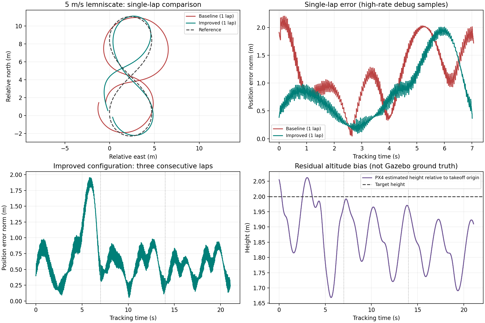

# 5 m/s Lemniscate 跟踪改进记录（2026-09-29）

## 结论

保持当前 Tailsitter-control 对应的质量、惯量、气动、推力和舵面参数不变，继续使用完整 alpha / INDI 控制链路。本轮主要改善机动段姿态带宽与外环纠偏能力，没有改用 PX4 姿态控制器。

- 相同单圈任务：任务节点统计的位置 RMS 从 **1.333 m 降至 0.943 m**（降低约 29.2%），峰值从 **2.206 m 降至 1.873 m**。
- 最终配置连续三圈：任务节点统计 RMS **0.681 m**，峰值 **1.811 m**；实际速度峰值 **5.411 m/s**。
- Gazebo GUI 开启；最终单圈和三圈均完成自动起飞、跟踪、退出、降落，没有触发任务中止。
- 仍有高度偏低：最终三圈按高频 debug 统计的逐圈平均向下误差为 **0.099 / 0.126 / 0.172 m**，不是已经消除了掉高。
- 这里只验证 **5 m/s**，没有验证任务默认的 6 m/s，也不代表其他速度、轨迹或真实飞机已验证。



## 最终保留参数

参数位于 `src/phoenix_tailsitter_control/phoenix_tailsitter_control/config.py`。姿态与角速度增益采用 **TS 机体系轴顺序**，不能直接当作 PX4 roll/pitch/yaw 顺序；位置、速度误差先从 NED 转到 TS 机体系，按 TS 轴施加增益，再变回 NED 做水平/垂向反馈限幅。

| 参数 | 最终值 | 用途 |
| --- | --- | --- |
| `attitude_gain` | [6, 6, 6] | 起飞、位置保持、降落等位置型参考 |
| `rate_gain` | [3, 3, 3] | 同上 |
| `tracking_attitude_gain` | [78.4, 54.88, 54.88] | Tailsitter-control 对应的机动段姿态增益 |
| `tracking_rate_gain` | [14, 9.8, 9.8] | 机动段角速度增益 |
| `tracking_position_gain` | [4, 2, 3] | 原值 [2, 1.5, 2.25] |
| `tracking_velocity_gain` | [4, 3, 3] | 保留较强速度阻尼 |
| `tracking_horizontal_acceleration_limit` | 3.0 m/s² | 原值 2.0；限制反馈纠偏量，不是总加速度 |
| `tracking_vertical_acceleration_limit` | 1.5 m/s² | 未改变 |
| `angular_acceleration_limit` | [20, 15, 24] rad/s² | 未改变 |
| `moment_limit` | [0.25, 0.08, 0.35] N·m | 未改变 |
| `use_measured_control_dt` | false | 默认保留标称 2 ms 控制周期 |
| `reference_rate_hz` | 20 Hz | 任务节点参考发布频率 |

机动增益的触发条件与现有外环一致：`setpoint_source=trajectory` 且加速度参考至少有一个有限分量。姿态增益权重每次按所选控制 dt 增减并限制在 [0,1]，约一个控制时间秒完成过渡。由于固定周期模式下实际回调通常约 2.4 ms，墙钟过渡时间不严格等于一秒。退出轨迹、转为位置型参考时平滑恢复基础姿态增益；动态状态重置时权重清零。

这种划分避免将高机动增益直接用于地面到离地过程。它是针对当前 PX4/Gazebo 执行器与状态链路的配置，不应称为原项目全飞行阶段逐项不变复现。

## 实验对比与判断

统一使用 5 m/s、每圈 7 s、起飞高度 2 m、爬升速度 0.15 m/s。每组重新启动仿真；除注明外均为单圈、20 Hz 参考。下表 RMS/峰值均来自任务节点的 track 阶段统计。

| 试验 | RMS / 峰值 (m) | 判断 |
| --- | --- | --- |
| 原增益、固定 dt，基准 | 1.333 / 2.206 | 对照 |
| 原增益，改用实际 dt | 1.852 / 2.550 | 单独修正时间步没有改善 |
| 原增益，参考频率 100 Hz | 1.921 / 3.085 | 未采用 |
| 原增益，仅水平反馈上限 2.2 | 1.560 / 2.558 | 单独放宽不够 |
| 中等机动内环增益 [12,12,18] / [5,5,6] | 1.559 / 2.567 | 姿态改善，但位置误差仍大 |
| 高机动内环增益，外环原项目位置/速度增益，上限 2 | 1.429 / 3.038 | 内环明显改善，外环仍需阻尼与余量 |
| 高机动内环 + 位置 [4,2,3] + 速度 [4,3,3] + 上限 3 | **0.943 / 1.873** | 保留 |
| 最终配置，固定 dt，三圈 | **0.681 / 1.811** | 验证连续跟踪 |
| 最终配置，实际 dt，三圈 | 0.684 / 1.820 | 基本持平，保持固定 dt 默认值 |

另测试过 TS-z 基础姿态增益增加，以及角速度参考的坐标变换假设。后者出现严重偏离并触发任务中止/近地紧急停机，相关改动已撤销，不能作为已验证修复。用四元数轨迹数值微分检查当前解析角速度前馈，误差约 2e-5 rad/s RMS，没有发现需要通过该改动修正的符号问题。

实测证据支持的主要原因：

1. **原机动姿态内环跟踪偏弱。** 基准 TS 三轴姿态误差 RMS 约 [6.63,8.66,15.01]°；最终单圈约 [2.60,4.59,5.66]°。姿态跟不上会使加速度前馈无法准确落到世界系。
2. **外环反馈长期限幅。** 基准单圈水平反馈约 92.4% 样本触及 2 m/s² 上限；最终单圈触及新 3 m/s² 上限的比例约 38.4%，三圈约 18.1%。改善来自内外环组合，不是仅靠增大上限。
3. **当前证据不支持执行器容量是主要瓶颈。** 最终三圈控制输出的电机归一化最大值约 0.726，舵面角指令绝对最大值约 0.288 rad（16.5°），力矩指令未触及现有限幅。这些是控制输出统计，不等于实际执行器瞬时无滞后。
4. **时序偏差存在，但不是单独的解决方案。** 最终固定 dt 三圈平均回调约 2.39 ms，不是标称 2 ms；实际 dt 模式三圈姿态略改善，但位置 RMS 没有明确改善，第三圈平均高度偏低约 0.237 m，反而大于固定 dt 的 0.172 m。
5. **入口瞬态仍占明显误差。** 最终固定 dt 三圈的高频 debug RMS 为 0.957 / 0.599 / 0.571 m，第一圈明显更差。

上述为当前仿真对照的观察，不是充分的统计因果证明；各候选没有完成大量重复随机试验。

## 统计口径与原始数据

任务 RMS 为任务节点采样的三维位置误差；图和逐圈诊断使用 `position_debug` 的高频采样以及 `rosout` 中的 track/exit 阶段时间。频率和采样时刻不同，数值不会完全相同，不要混用比较。

| 数据 | 任务 RMS (m) | 高频 debug RMS (m) | rosbag 路径 |
| --- | --- | --- | --- |
| 单圈基准 | 1.333 | 1.297 | `/tmp/phoenix_improve_fixed` |
| 最终单圈 | 0.943 | 1.015 | `/tmp/phoenix_improve_damped3` |
| 最终固定 dt 三圈 | 0.681 | 0.731 | `/tmp/phoenix_improve_damped3_multilap` |
| 最终实际 dt 三圈 | 0.684 | 0.729 | `/tmp/phoenix_improve_damped3_measured` |

高度由 PX4 位置估计与目标高度计算，不是 Gazebo ground truth。固定 dt 三圈逐圈最低高度约 1.668 / 1.721 / 1.691 m（目标 2 m）。三圈任务平均值包含两圈进入稳定跟踪后的数据，不能直接与单圈基准比较并宣称同样幅度的提升。

bag 文件仍在 `/tmp`，可能被系统清理，未加入仓库；对比图与三组任务原始结果摘录已保存到 `analysis/tracking_20260929.png` / `analysis/tracking_20260929.json`。

## 代码变化

- `config.py`：保留基础姿态增益，新增机动姿态增益；调大机动位置反馈和水平反馈上限。
- `attitude_control.py`：基础/机动姿态与角速度增益插值，默认调用仍使用基础增益。
- `alpha_controller_node.py`：按参考类型平滑切换内环增益；增加时序诊断与可选实际 dt；滤波、角加速度差分、执行器估计使用一致的所选 dt。
- `filters.py`：新增支持可变时间步的二阶 Butterworth 状态实现；标称周期下与原低通/高通实现等价。
- `tailsitter_alpha_sitl.launch.py`：暴露 `use_measured_control_dt`，默认 false。
- `lemniscate_mission_test.py`：可配置参考频率，默认 20 Hz，结果中记录该频率。
- 测试：增加滤波等价性、变步长、无效 dt、时序重置、增益混合覆盖。

继续保留本轮开始前工作区已有的安全修复：control_mode 超时从 0.5 s 调整为 1.5 s；降落前等待水平稳定；超时不在空中直接停机；新鲜落地状态确认；中止时刹车/爬升与近地失控保护。它们也会出现在当前 git diff 中，但不应全部归因于本轮跟踪调参。

`/phoenix_tailsitter/timing_debug` 为 10 Hz Float64MultiArray，依次是：窗口平均/最小/最大回调周期、所用滤波 dt、角速度消息/位置消息/执行器反馈消息到达年龄，单位均为秒。年龄是接收端到达年龄，不能直接当作完整传感器端到端延迟。

## 复现

从仓库根目录执行构建，然后启动 GUI：

```bash
source /opt/ros/jazzy/setup.bash
cd ros2_ws
colcon build --packages-select phoenix_tailsitter_control --symlink-install
source install/setup.bash
ros2 launch phoenix_tailsitter_control tailsitter_alpha_sitl.launch.py \
  headless:=false output_enabled:=true setpoint_source:=trajectory \
  use_measured_control_dt:=false
```

等待 Gazebo、PX4 和估计器就绪（本轮约 30 s），在另一个已 source ROS 和工作区的终端执行：

```bash
ros2 run phoenix_tailsitter_control lemniscate_mission_test --ros-args \
  -p confirmation:=PHOENIX_LEMNISCATE_MISSION_TEST \
  -p speed_m_s:=5.0 -p lap_time_s:=7.0 -p laps:=3 \
  -p takeoff_height_m:=2.0 -p climb_speed_m_s:=0.15 \
  -p takeoff_timeout_s:=90.0 -p land_timeout_s:=90.0 \
  -p reference_rate_hz:=20.0
```

仅用于当前 SITL 环境。仿真应从未倒地的初始状态开始。任务的 passed 门槛较宽松，应同时查看 RMS、峰值、轨迹和高度，不能只看 passed。

从仓库根目录重新生成图（需要现有 bags、ROS Python 环境、numpy 和 matplotlib）：

```bash
source /opt/ros/jazzy/setup.bash
python3 ros2_ws/analysis/plot_tracking_comparison.py \
  --baseline /tmp/phoenix_improve_fixed \
  --improved-single /tmp/phoenix_improve_damped3 \
  --improved-multilap /tmp/phoenix_improve_damped3_multilap \
  --output ros2_ws/analysis/tracking_20260929.png
```

## 验证

最终配置完成 colcon 构建；包内 pytest **87 passed**，工作区 colcon test-result 汇总 **91 tests、0 errors、0 failures**。最终试飞后仿真、任务与录包进程均已停止。

## 下一步

优先分开处理两类残余误差：先优化入口到周期轨迹的参考连续性，再对垂向估计加速度、推力实现与气动预测做同步残差分析。必要时再验证带限、抗积分饱和的低频垂向偏差补偿；不能只继续提高位置增益，也不能据本轮数据直接认定气动参数错误。下一轮至少保持三圈并增加重复试验，分别报告入口和稳态，不把 6 m/s 与 5 m/s 结果混在一起。
